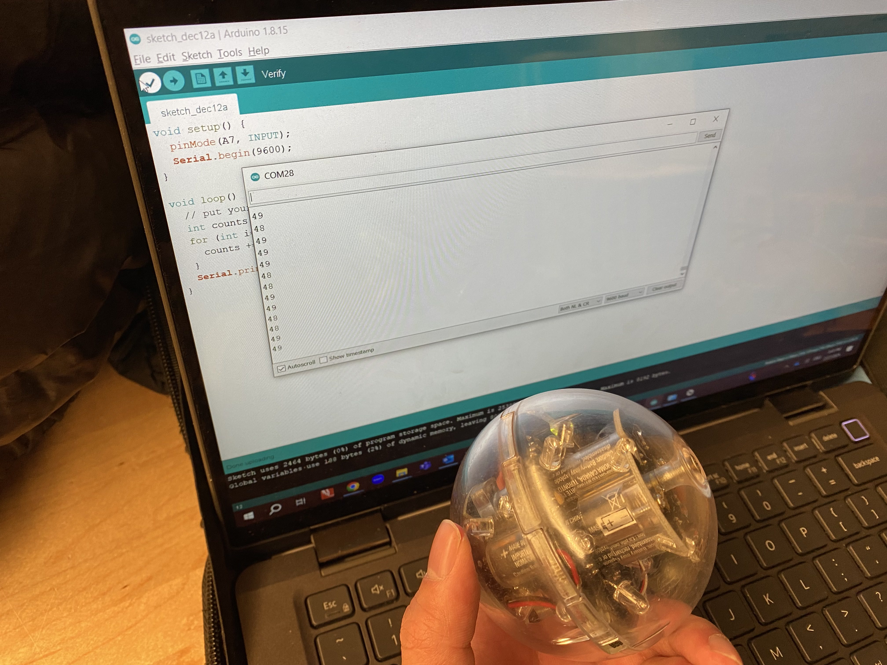
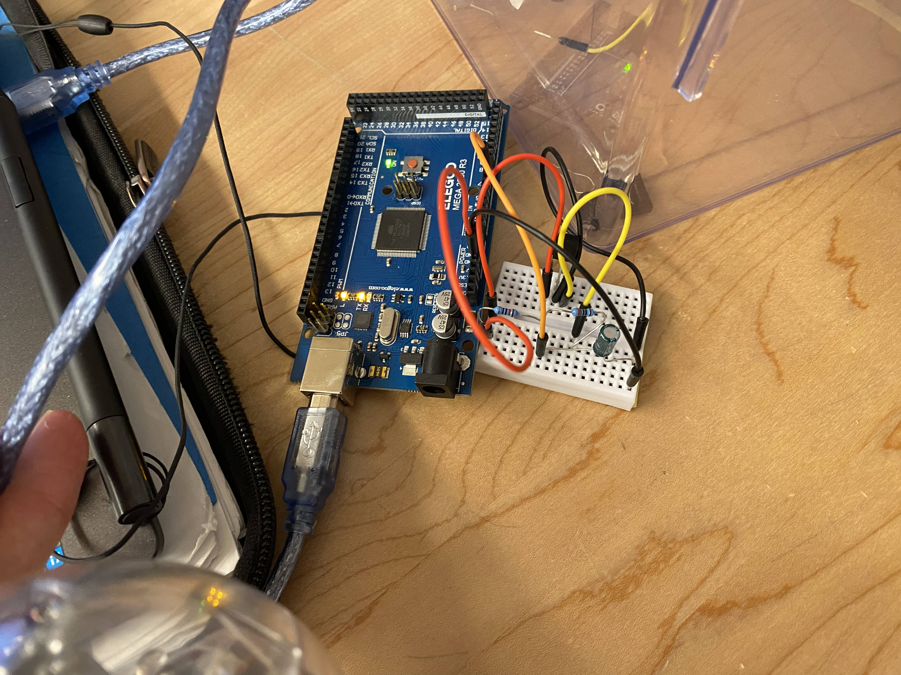
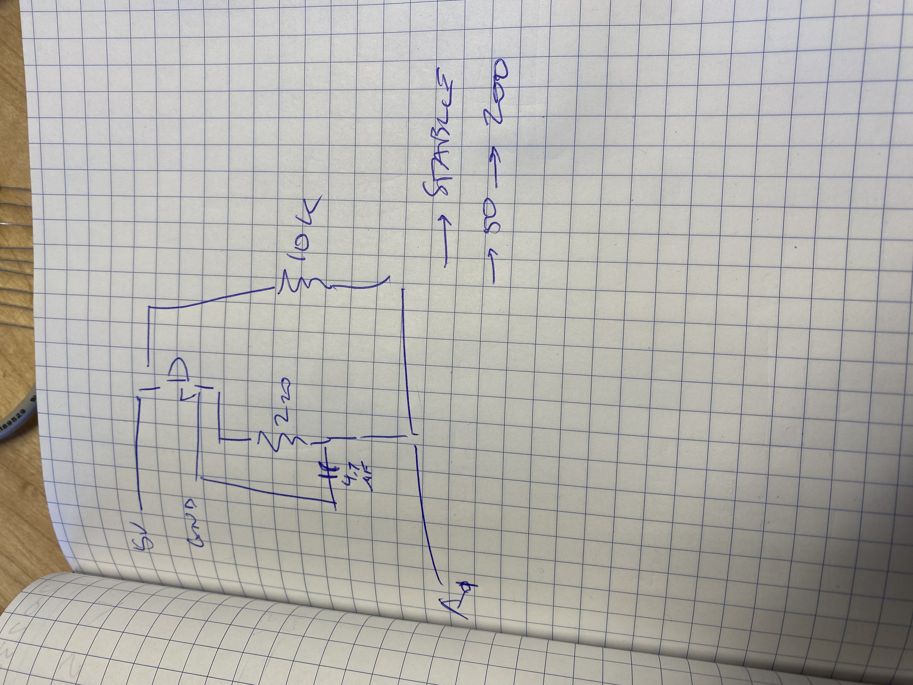
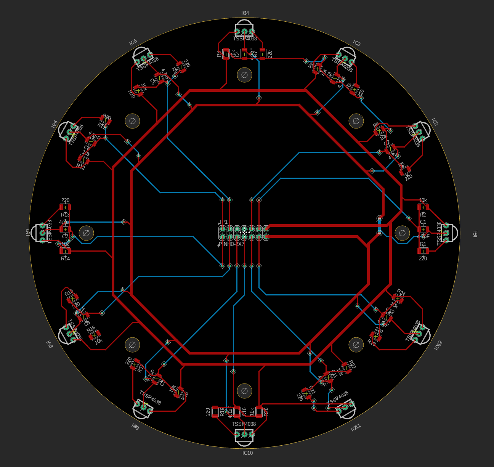
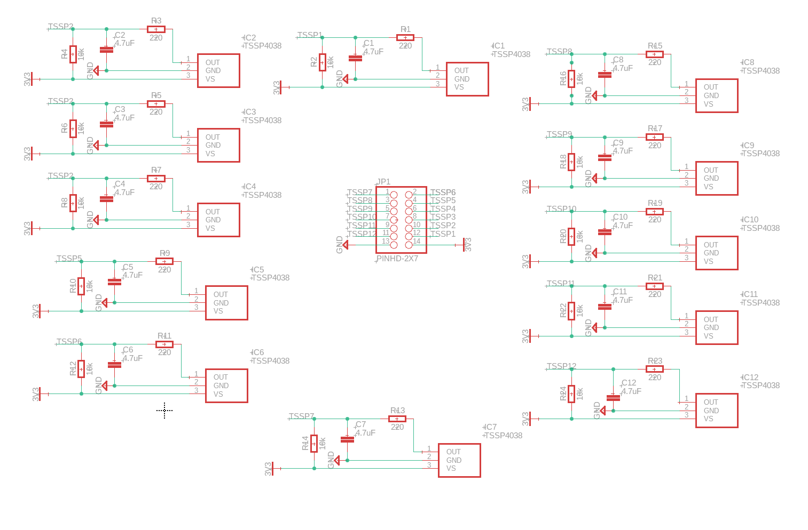
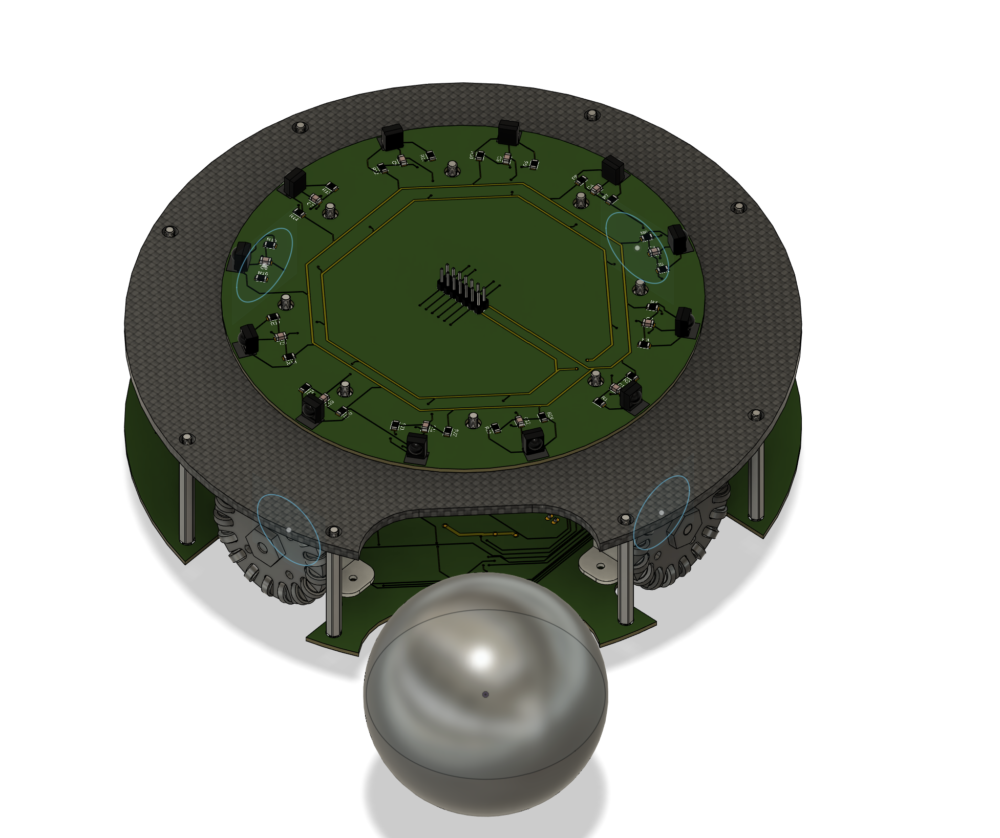

## Spint 2: Designing the Top PCB

## Goal
- Design a viable top level PCB design with 12 IR detectors oriented in increments of 30 degrees.
- Design a custom circuit for the operation of the TSSP 4038 IR detector.

## Research

IR receivers

https://www.luckylight.cn/en/products/infrared-led/infrared-receiver-module/#:~:text=An%20infrared%20receiver%2C%20or%20IR,infrared%20signal%20that%20it%20receives.

https://www.cablewholesale.com/support/technical_articles/infrared.php

- IR detectors with the electromagnetic range of 780nm to 1mm.
- Resides just above the visible light section of the electromagnetic spectrum.
- IR signals do not bend as well due to the shorter wavelengths.
- IR receivers detect the presence of IR light.
- Essentially a photodiode with a filter to remove visible light that may interfere with detection.
- Very simple, and usually exists in surface mount format or through hole format.


## Ideation
Two options:
1. Create a top level PCB that contains our custom chosen IR receiver component, and program and customize to our liking.
2. Use the pre-existing Modern Robotics IR Locator 360.

https://modernroboticsinc.com/product/ir-locator-360/

Pros of option 1:

- Very customizable and can be built to the precision that we would like.
- Usually much more accurate, since using these individually packaged IR recievers should net us better results since we can detect distance with each of them to calculate which is the closest to the ball and therefore in that direction.
- We can fix any issues that arise since we are intrinsically familiar with the component.
- Acts also as a great base for putting Teensies on for signal processing.
- Always in stock, we can produce more.

Cons of option 1:

- Very time consuming to make.
- Takes a lot of effort to get parts.
- Much more expensive since they are made in small amounts.
- Harder to program and use since there is no established documentation.

Pros of option 2:

- Easy to use and interface with rest of robot.
- Already exists so we can just salvage it.
- Already tested so we know the limits.

Cons of option 2:

- Not very accurate accoridng to previous testing.
- Out of stock everywhere and discontinued.
- Pretty expensive for how disposable they are.
- Lack of a solid core wire from the sensor.
- Not customizable.
- Cannot fix it breaks.
- Older technology.

Therefore, it would be only reasonable to build our own, since the discontinuing of the production of the IR Locator 360 alone is a dealbreaker for that option. The production and design of our own sensors will allow us more control and customization in terms of the distance we can detect and accuracy.


## Prototyping
We tested the IR receiver circuit before we started work on the PCB. The circuit worked relatively well, with a clear threshold where the ball is located. Included is the circuit design first proposed and tested by Dr. Lawrence. Note that the circuit itself and all the values as well as the circuit diagram was designed by Dr. Lawrence, while the PCB schematic, board design and component choice was done by the student.

Photodiode used: https://www.mouser.ca/ProductDetail/Vishay-Semiconductors/TSSP4038?qs=lgjwDzixuo3Ja5hn%252BEmOdw%3D%3D

Test circuit: 



The resulting values were around 37 when ball is right in front of the front of the IR receiver, >65 when it is about 2 meters away from the IR receiver. It should be noted that the values are increased by 10-15 if the ball is behind for both given values.

Test circuit schematic:

Courtesy of Dr. Benjamin Lawrence. This schematic was built collaboratively with the rest of the Robocup Team and Dr. Lawrence. (Mainly Dr. Lawrence).



Test circuit code:

```C++
void setup() {
  pinMode(A7, INPUT);
  Serial.begin(9600);
}

void loop() {
  // put your main code here, to run repeatedly:
  int counts = 0;
  for (int i=0; i<100; i++) {
    counts += analogRead(A7);
  }
  Serial.println(counts/100);
}
```

## Testing and Critique
This prototype is functional and gives values. However, it should be noted that:

- To achieve usable values there must be a low-pass filter and a pull up resistor for this to work.
- There must also be an average of 100 samples of the value, or else there is too much variation.
- The direction of each IR receiver must also be taken into account.

We will complete the PCB designs and send them in by the end of the two weeks. Manufacturer will require the following files:
1. The entire CAM profile suite
2. The CPL and BOM files (both csv)

They will also require selection of materials.

## Final Design

**REFER TO THE .sch and .brd FILES FOR THE FINAL FILES**

Final board:



Final schematic:


These are the final images of the PCB and schematic after all the traces are drawn. 

On the robot, the board will look like this:



## Conclusion

Overall, this is an extrememly ambitious project that should not be attempted in a sprint that was two weeks long. The traces part alone took almost two hours to complete (just under). However, this does teach significant amounts of signal processing and understanding of the electromagnetic spectrum, which would prove very useful in the field of computer engineering.

This project should not be attempted by beginners and intermediates at arduino, and only at the most advanced level. This is because of the difficulty of tracing errors in the PCB. If there were errors in the design (missing components, bad traces), we would find it near impossible to find any way of debugging it. Any trace could be the culprit and using a multimeter to look at each via and connection could be infeasible. There must be a certain level of understanding of foundational electrical engineering to ensure that this goal can be achieved.

**NOT WORTH YOUR TIME TO DO**
