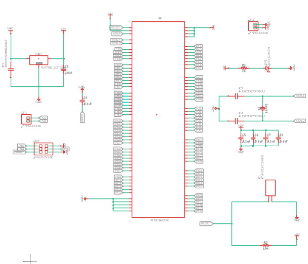
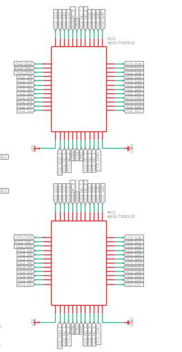
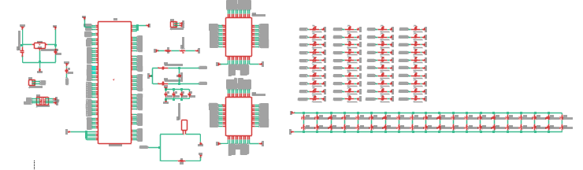
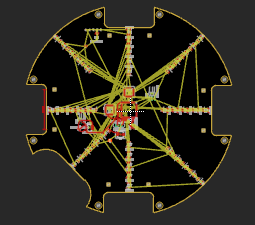
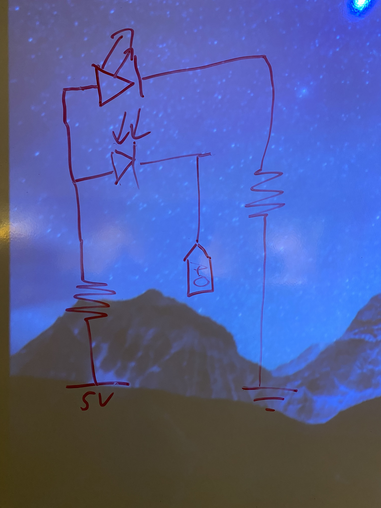
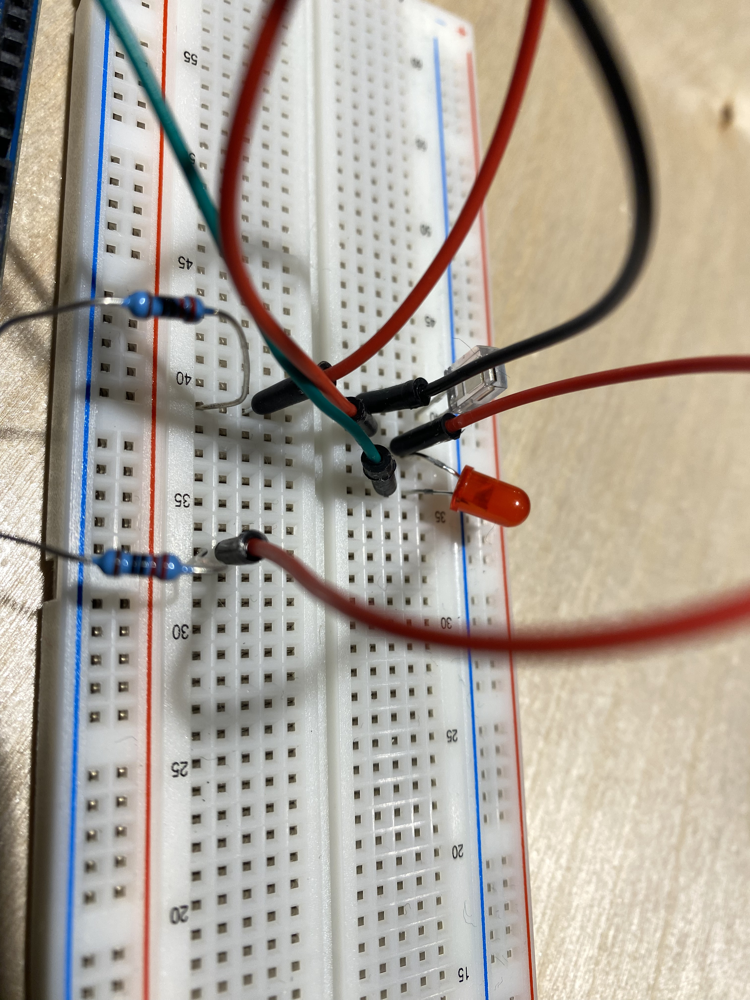
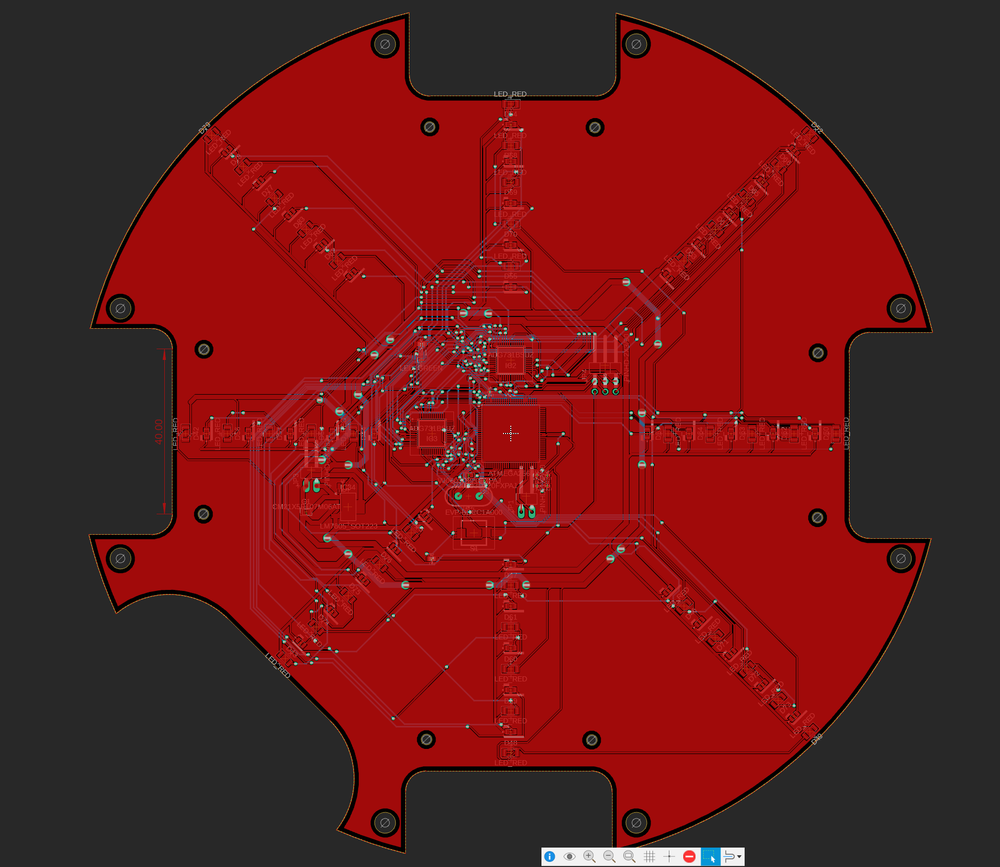
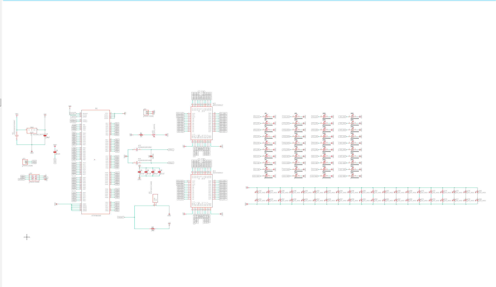
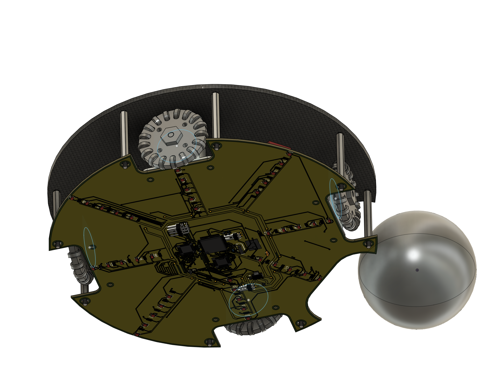

## Spint 1: Designing the Bottom PCB

## Goal
- Design a viable bottom PCB design with custom colour sensor circuit using SMD photodiodes ordered from company
- Design a standalone atmega 2560 that connects directly to each colour sensor without wires to minimize the amount of wiring on robot.

## Research

Photodiodes

https://www.teamwavelength.com/photodiode-basics/

https://www.digikey.ca/en/products/detail/advanced-photonix/PDB-C156/12675494

- Photodiodes' voltage drop depends on the amount of light that it gets.
- If we analogRead from the photodiode, we can gauge the amount of light.
- Needs to be surface mount in order to account for the distance between the game floor and our bottom board.
- Testing done with non surace mount.
- By using a specific colour LED that is found in white light but not green, can differentiate from the line and the green background.
- Needs LED light such as RED -> furthest away from green and found in RGB white.

Standalone atmega 2560

https://forum.arduino.cc/t/creating-a-standalone-atmega2560/465039

- The mega chip can be used standalone.
- Support circuitry is required.
- Elements are:
1. Voltage regulator.
2. Reset button.
3. Resonant circuit (clock signal)
4. ICSP 6 pin header (for connection) - will elaborate more
5. Power LED
6. 4 0.1uF capacitors to smooth out currents.

For the exact standalone diagram, see inserted picture.

ADG 731 - Monolithic CMOS 32 channel multiplexer

https://www.analog.com/en/products/adg731.html

https://www.analog.com/media/en/technical-documentation/data-sheets/ADG725_731.pdf

- Uses SPI to communicate with the main processor.
- Multiplexes 32 channels, expands pins for the amount of photodiodes we are using.
- Connects to all of our photodiodes and pin select is from three wire SPI.
- Requires a PCB to work.

See underneath for the circuit diagram. All the pins are broken out to the pins of the photodiodes. There are 20 photodiodes per multiplexer. Note that 3 wire SPI is on the bottom.

ICSP - Connection with bootloader

https://learn.sparkfun.com/tutorials/installing-an-arduino-bootloader/all

https://www.microchip.com/en-us/development-tool/atavrisp2

- By burning the bootloader and sketch into the microprocessor much like bios, we can code it without a serial port.
- Usually the MEGA 2560 has a atmegau16 chip on it to take care of serial processing
- The atmegau16 chips has code burned onto it and will process the usb connection and in turn program the atmega2560
- We can skip the atmegau16 burning process
- use AVRDude to burn our sketches and .hex files.
- Buy an atmel MK.II programmer to easily burn sketch and bootloader through ICSP.

## Ideation
Create a bottom PCB that will act as the bottom frame hosting the motors as well as detect colours on the bottom. Make hot-swappable in order to switch it out if any problems occur during the game.

- Create a board in the shape of the PCB
- Test out the photodiodes before starting the board.
- Add a standalone mega onto the PCB.
- Connect the standalone mega to two different 32-channel analog multiplexers through 3 wire SPI.
- Connect all of the photodiodes to the analog multiplexers.
- Add an SMD LED beside all analog multiplexers.
- Leave space for the future motor drivers.

See below for full schematic, as well as prototype board.

We will use ICSP to burn bootloaders and sketches straight into the atmega2560. We will use it in conjunction with AVRDUDE to burn the .hex files straight onto the chip. 

## Prototyping
We tested the photodiode circuit before we started work on the PCB. The photodiode circuit worked relatively well, with a clear threshold where the line is detected/not detected. We found the colour red to be the best one, since the other colours all are closer on the electromagnetic spectrum to green, making it harder to differentiate. The test circuits described were all tested with different coloured LEDs.

Photodiode used: https://www.digikey.ca/en/products/detail/advanced-photonix/PDB-C156/12675494

Test circuit: 

The resulting values were <55 for green, >60 for white. The breadboard design is included below for a working circuit tested with arduino analogRead().

Example circuit:

## Testing and Critique
This prototype is functional, but with the correct colour LEDs, and after experimenting with blue, yellow and red, we discovered that the greatest difference was with red. In about 10 minutes of continuous observation, we noted that there was no overlapping values, meaning the sensor is able to detect the line with an approximately 100% accuracy.

Note that:
- There is a pull-down resistor in the atmega 2560 chip itself, meaning that we do not have to pull down the output of the photodiode.
- We are going to use SMD LEDs.
- Manufacturer will be doing the PCBA process since we cannot solder on the LEDs without destroying the resin on it.
- We could do non-temperature sensitive SMD mounting with solder paste and an SMD rework gun.

We will complete the PCB designs and send them in by the end of the two weeks. Manufacturer will require the following files:
1. The entire CAM profile suite
2. The CPL and BOM files (both csv)

They will also require selection of materials.

## Final Design

**REFER TO THE .sch and .brd FILES FOR THE FINAL FILES**

Final board:

Final schematic:

These are the final images of the PCB and schematic after all the traces are drawn. 

On the robot, the board will look like this:

## Conclusion

Overall, this is an extrememly ambitious project that should not be attempted in a sprint that was two weeks long. The traces part alone took almost 10 hours to complete (just under). However, this does prove to be very educating, since it teaches the basics of an arduino. Through this knowledge, we can delve deeper into using the arduino and know the limitations of it, as well as explore circumstances where we do not have eenough I/O pins to accomodate for the huge amount of sensors.

This project should not be attempted by beginners and intermediates at arduino, and only at the most advanced level. This is because of the difficulty of tracing errors in the PCB. If there were errors in the design (missing components, bad traces), we would find it near impossible to find any way of debugging it. Any trace could be the culprit and using a multimeter to look at each via and connection could be infeasible. There must be a certain level of understanding of foundational electrical engineering to ensure that this goal can be achieved.

**NOT WORTH YOUR TIME TO DO**

